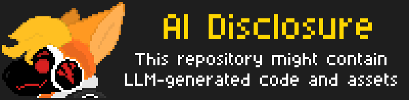
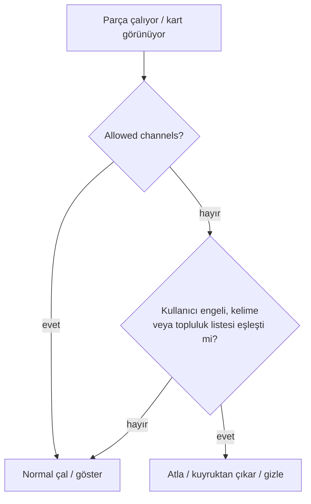
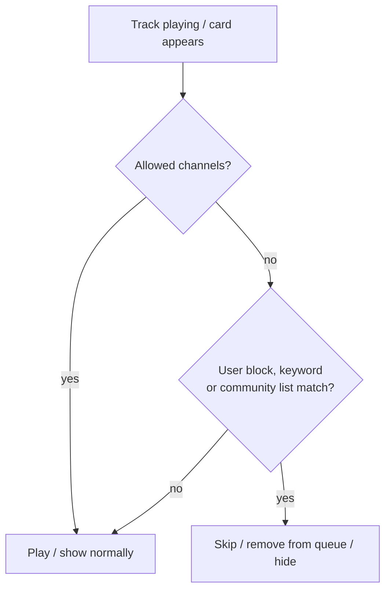

<div align="center">

<<<<<<< HEAD
# :pear: Pear Desktop

[](https://github.com/michei69/pear-desktop/releases/)
[](https://github.com/michei69/pear-desktop/blob/master/license)
[](https://GitHub.com/michei69/pear-desktop/releases/)
[](https://GitHub.com/michei69/pear-desktop/releases/)

[](https://snyk.io/test/github/michei69/pear-desktop)


</div>

<!--  -->

### Note: This is a fork of the original project. [Click here for the upstream version](https://github.com/pear-devs/pear-desktop)
### Note: Updates may break certain features. Report any issues in [this fork's page](https://github.com/michei69/pear-desktop/issues) NOT in the official one

- Native look & feel extension

> [!IMPORTANT]
> ⚠️ Disclaimer
>
> **No Affiliation**
>
> This project, and its contributors, are not affiliated with, authorized by, endorsed by, or in any way officially connected with Google LLC, YouTube, or any of their subsidiaries or affiliates. **This is an independent, non-profit, and unofficial extension developed by a team of volunteers with the goal of providing a desktop experience.**
>
> **Trademarks**
>
> The names "Google" and "YouTube Music", as well as related names, marks, emblems, and images, are registered trademarks of their respective owners. Any use of these trademarks is for identification and reference purposes only and does not imply any association with the trademark holder. We have no intention of infringing upon these trademarks or causing harm to the trademark holders.
>
> **Limitation of Liability**
>
> This application (extension) is provided "AS IS", and you use it at your own risk. In no event shall the developers or contributors be liable for any claim, damages, or other liability, including any legal consequences, arising from, out of, or in connection with the software or the use or other dealings in the software. The responsibility for any and all outcomes of using this software rests entirely with the user.

## Content

- [Features](#features)
- [Translation](#translation)
- [Download](#download)
  - [Linux](#linux)
  - [MacOS](#macos)
  - [Windows](#windows)
    - [How to install without a network connection? (in Windows)](#how-to-install-without-a-network-connection-in-windows)
- [Themes](#themes)
- [Dev](#dev)
- [Build your own plugins](#build-your-own-plugins)
  - [Creating a plugin](#creating-a-plugin)
  - [Common use cases](#common-use-cases)
- [Build](#build)
- [Production Preview](#production-preview)
- [Tests](#tests)
- [License](#license)
- [FAQ](#faq)

## Translation

You can help with translation on [Hosted Weblate](https://bit.ly/48n5YF7).

<a href="https://bit.ly/48n5YF7">
  
  
</a>

## Download

You can check out the [latest release](https://github.com/michei69/pear-desktop/releases/latest) to quickly find the
latest version.

### Linux

Easiest way to install is via the provided **flatpak** (tested). You can also try out the other formats (deb, rpm, snap, tarball, appimage) but be aware these may or may not have issues.

### macOS

Please install manually via the provided DMG.

If you get an error "is damaged and can’t be opened." when launching the app, run the following in the Terminal:

```bash
/usr/bin/xattr -cr /Applications/Pear\ Desktop.app
```

### Windows

Please install manually via the provided Web Setup. Alternatively, you can use the provided portable executable instead.


#### How to install without a network connection? (in Windows)

- Download the `*.nsis.7z` file for _your device architecture_ in [release page](https://github.com/michei69/pear-desktop/releases/latest).
  - `x64` for 64-bit Windows
  - `ia32` for 32-bit Windows
  - `arm64` for ARM64 Windows
- Download installer in release page. (`*-Setup.exe`)
- Place them in the **same directory**.
- Run the installer.

## Themes

Do you have a CSS theme file already? You can load it from **Options ▸ Visual Tweaks ▸ Theme ▸ Import custom CSS file**.

Are you looking for community-made themes for our app? Check out https://github.com/michei69/pear-desktop-themes

Want to get started with building themes? [Click here for the documentation](./src/themes/README.md)

## Dev

```bash
git clone https://github.com/michei69/pear-desktop
cd pear-desktop
pnpm install --frozen-lockfile
pnpm dev
```

Instead of installing pnpm on your system, you can also use [devcontainers](https://containers.dev/). You can use devcontainers either as a development environment in VS Code, or as a way to easily build the project without installing dependencies on your host system.

Note that this has it's own limitations (for example, GUI doesn't work on, at least some, Linux hosts).

## Build your own plugins

Using plugins, you can:

- manipulate the app - the `BrowserWindow` from electron is passed to the plugin handler
- change the front by manipulating the HTML/CSS

### Creating a plugin

Create a folder in `src/plugins/YOUR-PLUGIN-NAME`:

- `index.ts`: the main file of the plugin
```typescript
import style from './style.css?inline'; // import style as inline

import { createPlugin } from '@/utils';

export default createPlugin({
  name: 'Plugin Label',
  restartNeeded: true, // if value is true, ytmusic show restart dialog
  config: {
    enabled: false,
  }, // your custom config
  stylesheets: [style], // your custom style,
  menu: async ({ getConfig, setConfig }) => {
    // All *Config methods are wrapped Promise<T>
    const config = await getConfig();
    return [
      {
        label: 'menu',
        submenu: [1, 2, 3].map((value) => ({
          label: `value ${value}`,
          type: 'radio',
          checked: config.value === value,
          click() {
            setConfig({ value });
          },
        })),
      },
    ];
  },
  backend: {
    start({ window, ipc }) {
      window.maximize();

      // you can communicate with renderer plugin
      ipc.handle('some-event', () => {
        return 'hello';
      });
    },
    // it fired when config changed
    onConfigChange(newConfig) { /* ... */ },
    // it fired when plugin disabled
    stop(context) { /* ... */ },
  },
  renderer: {
    async start(context) {
      console.log(await context.ipc.invoke('some-event'));
    },
    // Only renderer available hook
    onPlayerApiReady(api, context) {
      // set plugin config easily
      context.setConfig({ myConfig: api.getVolume() });
    },
    onConfigChange(newConfig) { /* ... */ },
    stop(_context) { /* ... */ },
  },
  preload: {
    async start({ getConfig }) {
      const config = await getConfig();
    },
    onConfigChange(newConfig) {},
    stop(_context) {},
  },
});
```

### Common use cases

- injecting custom CSS: create a `style.css` file in the same folder then:

```typescript
// index.ts
import style from './style.css?inline'; // import style as inline

import { createPlugin } from '@/utils';

export default createPlugin({
  name: 'Plugin Label',
  restartNeeded: true, // if value is true, pear-desktop will show a restart dialog
  config: {
    enabled: false,
  }, // your custom config
  stylesheets: [style], // your custom style
  renderer() {} // define renderer hook
});
```

- If you want to change the HTML:

```typescript
import { createPlugin } from '@/utils';

export default createPlugin({
  name: 'Plugin Label',
  restartNeeded: true, // if value is true, ytmusic will show the restart dialog
  config: {
    enabled: false,
  }, // your custom config
  renderer() {
    console.log('hello from renderer');
  } // define renderer hook
});
```

- communicating between the front and back: can be done using the ipcMain module from electron. See `index.ts` file and
  example in `sponsorblock` plugin.

## Build

1. Clone the repo
2. Follow [this guide](https://pnpm.io/installation) to install `pnpm`
3. Run `pnpm install --frozen-lockfile` to install dependencies
4. Run `pnpm build:OS`

- `pnpm dist:win` - Windows
- `pnpm dist:linux` - Linux (amd64)
- `pnpm dist:linux:deb-arm64` - Linux (arm64 for Debian)
- `pnpm dist:linux:rpm-arm64` - Linux (arm64 for Fedora)
- `pnpm dist:mac` - macOS (amd64)
- `pnpm dist:mac:arm64` - macOS (arm64)

Builds the app for macOS, Linux, and Windows,
using [electron-builder](https://github.com/electron-userland/electron-builder).

### Building in devcontainer

1. Clone the repo;
2. Open the folder in VS Code;
3. Reopen in container when prompted;
4. Run `pnpm build` as above (choosing the desired target);
5. Collect the built files from the `dist` folder.

Since devcontainer uses a mount for the workspace, the built files will be available on the host system as well.

## Production Preview

```bash
pnpm start
```

## Tests

```bash
pnpm test
```

Uses [Playwright](https://playwright.dev/) to test the app.

## License

MIT © [pear-devs](https://github.com/pear-devs/pear-desktop)<br/>
MIT © [michei69](https://github.com/michei69/pear-desktop)

## FAQ

### Why apps menu isn't showing up?

If `Hide Menu` option is on - you can show the menu with the <kbd>alt</kbd> key (or <kbd>\`</kbd> [backtick] if using
the in-app-menu plugin)
=======
# 🎵 pear-desktop-ai-slop-filter

**Topluluk tarafından derlenen bir kara liste ve bunu kullanarak AI üretimi kanalları/şarkıları atlayan, gizleyen bir Pear Desktop eklentisi.**

**A community-curated blacklist and a Pear Desktop plugin that skips and hides AI-generated channels/tracks.**

[](blacklist.json)
[](#şema-version-2)
[](#lisans)
[](#durum)

[Türkçe](#türkçe) · [English](#english) · [Issue](https://github.com/bwedirhan/pear-desktop-ai-slop-filter/issues/new) · [Star](https://github.com/bwedirhan/pear-desktop-ai-slop-filter)



</div>

---

# Türkçe

## İçindekiler

- [Durum](#durum)
- [Nasıl çalışır](#nasıl-çalışır)
- [Ayarlar](#ayarlar)
- [Gizlilik](#gizlilik)
- [Şema (version: 2)](#şema-version-2)
- [Rapor ve itiraz](#rapor-ve-itiraz)
- [Kurulum (geliştirici)](#kurulum-geliştirici)
- [Bilinen sınırlamalar](#bilinen-sınırlamalar)
- [Lisans](#lisans)
- [Krediler](#krediler)

## Durum

> [!WARNING]
> **Durum: Geliştirme.** Eklenti Pear Desktop'ın geliştirme modunda (`pnpm dev`) denendi:
> `videoId` / `channelId` eşleşmesiyle atlama ve listenin GitHub'dan indirilmesi çalışıyor.
> Sayfalarda gizleme, kuyruk / otomatik oynatma ön süzgeci ve "ilgilenmiyorum" bildirimi
> daha yeni özellikler ve daha az denendi. Paketlenmiş (production) sürüm henüz test edilmedi.

## Nasıl çalışır

- Kara liste bu repoda **düz bir JSON dosyası** (`blacklist.json`) olarak durur. Sunucu, API, veritabanı yok.
- Eklenti dosyayı `raw.githubusercontent.com` üzerinden indirir ve önbelleğe alır.
  **Önbellek 24 saat** geçerlidir (yalnızca kimlikler saklanır). Uygulama açık kaldıkça saatte bir önbelleğin süresine bakılır.
- Eşleştirme **cihazda** yapılır: çalan parçanın ve ekrandaki kartların `channelId` / `videoId` bilgisi listeyle karşılaştırılır.
- **Çalarken:** Eşleşirse `nextVideo()` ile atlanır. Kısa sürede çok fazla atlama olursa
  (örneğin kuyruğun tamamı listedeyse) eklenti kendini durdurur: **10 saniyede en fazla 5 atlama**.
- **Kuyruk:** Kuyruk veya çalma listesi açıldığında işaretli parçalar toplu olarak kuyruktan çıkarılır
  (çalan parça hariç). Otomatik oynatma (automix) parçaları kuyruğa girmeden elenir.
- **Sayfalar:** Arama, ana sayfa, keşfet, kütüphane, sanatçı, albüm ve çalma listesi sayfalarında
  işaretli sonuçlar gizlenir ("Hide in pages", varsayılan açık). Önizleme aşaması (`early.ts`)
  bilinen kartları çizilmeden gizlemeye çalışır; asıl eklenti başlayınca her kartı gerçek verisiyle
  yeniden değerlendirir ve yanlış gizlenenleri geri açar.
- **Öğrenilen sanatçı:** Yükleyici kanal listedeyse ama kuyruktaki sanatçı kanalı listede değilse,
  sanatçı **yalnızca o oturum için** engellenir; kalıcı olarak kaydedilmez. "Allow" bunu geçersiz kılar.
- İndirilen liste şema doğrulamasından geçmezse yok sayılır, **son geçerli önbellek** kullanılır.

### Öncelik sırası

Bir parça veya kart için karar şu sırayla verilir, ilk eşleşen kazanır:

1. **Allowed channels:** hiçbir koşulda filtrelenmez
2. **Blocked channels:** her zaman filtrelenir
3. Oturumda öğrenilen sanatçı
4. **Blocked keywords:** başlıkta, sonra kanal adında
5. Topluluk listesi: önce kanal, sonra parça



## Ayarlar

Ayarlar ▸ Eklentiler ▸ **Skip AI Slop**. Eklenti varsayılan olarak **kapalıdır**, önce etkinleştirin.

| Ayar | Açıklama |
|---|---|
| **Hide in pages** | Arama, ana sayfa, keşfet, kütüphane ve listelerde işaretli sonuçları gizler. Varsayılan açık. |
| **Send "Not interested" to YouTube for home recommendations** | İşaretli ana sayfa önerileri için hesabınıza kalıcı "ilgilenmiyorum" geri bildirimi gönderir. Yavaş ve sınırlıdır. **Varsayılan kapalı.** |
| **Blocked keywords** | Başlığında veya kanal adında geçen şarkıları atlar. Büyük/küçük harf fark etmez; **tam kelime** (veya ifade) eşleşir: `ai`, "AI Cover"ı yakalar ama "Mai"yi yakalamaz. |
| **Blocked channels** | "Sanatçıyı önerme" dediğiniz ve eklentinin YouTube'a bildirdiği kanallar, ayrıca elle eklediklerin. |
| **Recently filtered** | Kelime veya listeyle yakalanan son kanallar. Yanlış eşleşme varsa **Allow**'a basın. |
| **Allowed channels** | Hiçbir koşulda filtrelenmeyen kanallar. |

## Gizlilik

- **Dinleme geçmişiniz hiçbir yere gönderilmez.** Eşleştirme cihazda yapılır.
- Varsayılan durumda **tek ağ isteği kara liste dosyasının kendisidir**
  (GitHub bu istekte IP adresinizi ve User-Agent bilgisini görür).
- "Send 'Not interested'..." seçeneğini **siz açarsanız**, uygulama YouTube Music'e hesabınızla
  geri bildirim isteği gönderir. Bu istekler repo sahibine veya başka bir yere gitmez.
- Tarayıcı depolamasında (localStorage) şunlar tutulur: indirilen listenin kimlik önbelleği,
  "Recently filtered" listesi (en fazla 60 kanal) ve bildirimi yapılmış kanalların kimlikleri.

## Şema (`version: 2`)

```json
{
  "version": 2,
  "updated_at": "ISO-8601",
  "channels": {
    "UCxxxxxxxxxxxxxxxxxxxxxx": {
      "name": "...",
      "reason": "...",
      "added_at": "YYYY-MM-DD"
    }
  },
  "tracks": {
    "videoId": {
      "title": "...",
      "reason": "...",
      "added_at": "YYYY-MM-DD"
    }
  }
}
```

| Alan | Zorunlu | Açıklama |
|---|---|---|
| `version` | ✅ | Şema sürümü. Eklenti **yalnızca `2`** kabul eder. |
| `updated_at` | ✅ | Son güncelleme tarihi (ISO-8601) |
| `channels` | ✅ | `UC...` ile başlayan kanal ID'leri (birincil) |
| `tracks` | ✅ | Video ID'leri (ikincil). Şu an boş. |
| `name` / `title` | ✅ | Görüntülenecek isim |
| `reason` | ✅ | Engelleme gerekçesi |
| `added_at` | ✅ | Listeye eklenme tarihi (`YYYY-MM-DD`) |

**Anahtar olarak kanal ID'si birincil, videoId ikincil.**
İsim+sanatçı eşleştirmesi bilinçli olarak **yok** (yanlış pozitif riski).
Kanal ID'si, kanal adresindeki `UC...` ile başlayan 24 karakterlik kısımdır.

Kayıtların bir kısmı otomatik AI skorlarına (ör. ZoundHub / SubmitHub) ve topluluk işaretlerine dayanır;
gerekçe her kaydın `reason` alanında yazar. Otomatik skorlar kesin kanıt değildir.

## Rapor ve itiraz

### Bildirim

1. **Issues** sekmesine gidin
2. **"AI Slop Bildirimi"** şablonunu kullanın
3. Bildirimler `unverified-report` etiketiyle gelir
4. Bir maintainer doğrulayınca `blacklist.json`'a eklenir

> [!IMPORTANT]
> **Kanıt şartı:** Kanıtsız veya tek başına "kulağa AI gibi geliyor" raporları **eklenmez**.

### İtiraz

Listedeki bir kayıt **yanlış engelleme** ise (örneğin gerçek bir sanatçı):

1. Kanal/şarkı bağlantısıyla bir **Issue** açın
2. Kayıt incelenir ve gerekirse **kaldırılır**

Beklerken eklentide kanalı **Allow** listesine alarak anında kendiniz çözebilirsiniz.

## Kurulum (geliştirici)

Pear Desktop eklentileri uygulamanın kaynak kodunun içinde derlenir. Node.js ve `pnpm` gerekir.

### 1. Pear Desktop'ı klonlayın

```bash
git clone https://github.com/pear-devs/pear-desktop
cd pear-desktop
pnpm install --frozen-lockfile
```

### 2. Eklenti klasörünü kopyalayın

Bu repodaki **`src/plugins/skip-ai-slop/` klasörünün tamamını** (5 dosya) Pear Desktop'ta aynı konuma koyun:

```
pear-desktop/
└── src/
    └── plugins/
        └── skip-ai-slop/
            ├── index.ts
            ├── config.ts
            ├── early.ts
            ├── ChannelLists.tsx
            └── KeywordList.tsx
```

> [!NOTE]
> Yalnızca `index.ts` yetmez; diğer dosyalar eksikse derleme `Failed to resolve import` hatası verir.

### 3. Kara liste adresini kontrol edin

`index.ts` içindeki `BLACKLIST_URL` varsayılan olarak bu repoyu gösterir. Kendi fork'unuzun listesini
kullanacaksanız değiştirin:

```ts
const BLACKLIST_URL =
  'https://raw.githubusercontent.com/KULLANICI_ADI/pear-desktop-ai-slop-filter/main/blacklist.json';
```

> [!NOTE]
> Repo **public** olmalı. Private repo'lardaki raw adresler kimlik doğrulama ister ve eklenti bunu yapamaz.

### 4. Başlatın ve etkinleştirin

```bash
pnpm dev
```

Geliştirme denemesinde eklenti klasöre kopyalanınca otomatik bulundu; listede görünmezse
diğer eklentilerin nasıl kaydedildiğine bakın. **Ayarlar ▸ Eklentiler** yolundan etkinleştirin.
Hata ayıklamak için geliştirici konsolunda `[skip-ai-slop]` ile başlayan satırlara bakın.

## Bilinen sınırlamalar

| Sınırlama | Durum |
|---|---|
| Kanal ID'si olmayan kayıtlar eklenemez | ⛔ Bilinçli tasarım |
| `tracks` desteklenir ama liste şu an yalnızca kanal içerir | ℹ️ Bilgi |
| Yanlış pozitif riski (özellikle `anonymous` işaretli ve otomatik skorlu kayıtlar) | ⚠️ Dikkat |
| Önbellek 24 saat; GitHub'a yapılan değişiklikler hemen yansımaz | ⚠️ Bilinçli tasarım |
| Skip limiti: 10 saniyede en fazla 5 atlama | ✅ Güvenlik freni |
| Anahtar kelimeler yalnızca tam kelime eşleşir (kelime içi eşleşme yok) | ⚠️ Bilinçli tasarım |
| Sayfa gizleme YouTube Music'in iç yapısına bağlıdır; güncellemeler eklentiyi kırabilir | ⚠️ Genel risk |
| "Yeniden dinle" raflarındaki kartlar yalnızca yerelde gizlenir, YouTube'a bildirilmez | ✅ Bilinçli tasarım |
| Paketlenmiş (production) sürüm test edilmedi | 🚧 Açık |

## Lisans

- **Kara liste verisi** (`blacklist.json`): [CC0-1.0](https://creativecommons.org/publicdomain/zero/1.0/)
- **Eklenti kodu**: [MIT](https://opensource.org/licenses/MIT)

> [!NOTE]
> Repo kökündeki `LICENSE` dosyası MIT'dir. Veri için CC0 geçerli olsun
> isteniyorsa ayrı bir `LICENSE-DATA` dosyası eklenmelidir.

## Krediler

- AI açıklama görseli (`assets/x4.png`): michei69.
- Bu repo LLM tarafından üretilmiş kod ve görseller içerebilir.

---

# English

## Table of Contents

- [Status](#status)
- [How it works](#how-it-works)
- [Settings](#settings)
- [Privacy](#privacy)
- [Schema (version: 2)](#schema-version-2)
- [Reporting and appeals](#reporting-and-appeals)
- [Installation (developer)](#installation-developer)
- [Known limitations](#known-limitations)
- [License](#license)
- [Credits](#credits)

## Status

> [!WARNING]
> **Status: Development.** The plugin has been tested in Pear Desktop's development mode (`pnpm dev`):
> skipping via `videoId` / `channelId` matching and downloading the list from GitHub work.
> Page hiding, the queue / autoplay pre-filter and the "Not interested" reports are newer and
> less tested. The packaged (production) build has not been tested yet.

## How it works

- The blacklist lives in this repo as a **plain JSON file** (`blacklist.json`). No server, no API, no database.
- The plugin downloads the file from `raw.githubusercontent.com` and caches it.
  **The cache is valid for 24 hours** (only the IDs are stored). While the app stays open, the cache age is checked hourly.
- Matching happens **on-device**: the `channelId` / `videoId` of the playing track and of the cards on screen
  are compared against the list.
- **While playing:** On a match the plugin calls `nextVideo()` to skip. If too many skips happen in a
  short window (e.g. the entire queue is listed), the plugin throttles itself: **max 5 skips per 10 seconds**.
- **Queue:** When a queue or playlist opens, flagged tracks are removed from the queue in one go
  (never the playing one). Autoplay (automix) tracks are dropped before they enter the queue.
- **Pages:** Flagged results are hidden on search, home, explore, library, artist, album and playlist pages
  ("Hide in pages", on by default). A preload stage (`early.ts`) tries to hide known cards before they are
  drawn; once the main plugin starts it re-judges every card from its real data and un-hides anything
  hidden by mistake.
- **Learned artist:** If the uploader channel is on the list but the queued artist channel is not, that
  artist is blocked **for the current session only**; it is never saved. "Allow" overrides it.
- If the downloaded list fails schema validation, it is ignored and the **last valid cache** is used.

### Priority order

For each track or card the decision is made in this order; the first match wins:

1. **Allowed channels:** never filtered
2. **Blocked channels:** always filtered
3. Artist learned this session
4. **Blocked keywords:** in the title, then in the channel name
5. Community list: channel first, then track



## Settings

Settings ▸ Plugins ▸ **Skip AI Slop**. The plugin is **off by default**; enable it first.

| Setting | Description |
|---|---|
| **Hide in pages** | Hides flagged results in search, home, explore, library and playlists. On by default. |
| **Send "Not interested" to YouTube for home recommendations** | Sends permanent "not interested" feedback to your YouTube account for flagged home recommendations. Slow and rate-limited. **Off by default.** |
| **Blocked keywords** | Skips tracks whose title or channel name contains one of these words. Case-insensitive; matches **whole words** (or phrases): `ai` catches "AI Cover" but not "Mai". |
| **Blocked channels** | Channels you marked "Don't recommend", ones the plugin reported to YouTube, and ones you added by hand. |
| **Recently filtered** | Channels most recently caught by a keyword or the community list. Press **Allow** if one is a false match. |
| **Allowed channels** | Channels that are never filtered, no matter what. |

## Privacy

- **Your listening history is never sent anywhere.** Matching happens on-device.
- By default **the only network request is the blacklist file itself**
  (GitHub sees your IP address and User-Agent in that request).
- If **you turn on** "Send 'Not interested'...", the app sends feedback requests to YouTube Music
  with your account. These requests do not go to the repo owner or anywhere else.
- Browser storage (localStorage) holds: the ID cache of the downloaded list, the "Recently filtered"
  list (at most 60 channels) and the IDs of channels already reported.

## Schema (`version: 2`)

```json
{
  "version": 2,
  "updated_at": "ISO-8601",
  "channels": {
    "UCxxxxxxxxxxxxxxxxxxxxxx": {
      "name": "...",
      "reason": "...",
      "added_at": "YYYY-MM-DD"
    }
  },
  "tracks": {
    "videoId": {
      "title": "...",
      "reason": "...",
      "added_at": "YYYY-MM-DD"
    }
  }
}
```

| Field | Required | Description |
|---|---|---|
| `version` | ✅ | Schema version. The plugin accepts **only `2`**. |
| `updated_at` | ✅ | Last update timestamp (ISO-8601) |
| `channels` | ✅ | Channel IDs starting with `UC...` (primary) |
| `tracks` | ✅ | Video IDs (secondary). Currently empty. |
| `name` / `title` | ✅ | Display name |
| `reason` | ✅ | Reason for blocking |
| `added_at` | ✅ | Date added to the list (`YYYY-MM-DD`) |

**Channel ID is the primary key; videoId is secondary.**
Name+artist matching is intentionally **not** used (false positive risk).
A channel ID is the 24-character part starting with `UC...` in a channel's URL.

Some entries are based on automated AI scores (e.g. ZoundHub / SubmitHub) and community markers;
the basis is stated in each entry's `reason` field. Automated scores are not conclusive proof.

## Reporting and appeals

### Reporting

1. Go to the **Issues** tab
2. Use the **"AI Slop Report"** template
3. Reports are tagged with `unverified-report`
4. Once verified by a maintainer, the entry is added to `blacklist.json`

> [!IMPORTANT]
> **Evidence required:** Reports without evidence, or based solely on "it sounds AI",
> are **not accepted**.

### Appeals

If an entry is a **false positive** (e.g. a real artist):

1. Open an **Issue** with the channel/track link
2. The entry is reviewed and **removed** if necessary

While you wait you can fix it yourself right away by putting the channel on the **Allow** list in the plugin.

## Installation (developer)

Pear Desktop plugins are compiled inside the app's source code. You need Node.js and `pnpm`.

### 1. Clone Pear Desktop

```bash
git clone https://github.com/pear-devs/pear-desktop
cd pear-desktop
pnpm install --frozen-lockfile
```

### 2. Copy the plugin folder

Copy the **whole `src/plugins/skip-ai-slop/` folder** (5 files) from this repo to the same path in Pear Desktop:

```
pear-desktop/
└── src/
    └── plugins/
        └── skip-ai-slop/
            ├── index.ts
            ├── config.ts
            ├── early.ts
            ├── ChannelLists.tsx
            └── KeywordList.tsx
```

> [!NOTE]
> `index.ts` alone is not enough; if the other files are missing the build fails with `Failed to resolve import`.

### 3. Check the blacklist URL

`BLACKLIST_URL` in `index.ts` points to this repo by default. If you want to use your own fork's list, change it:

```ts
const BLACKLIST_URL =
  'https://raw.githubusercontent.com/YOUR_USERNAME/pear-desktop-ai-slop-filter/main/blacklist.json';
```

> [!NOTE]
> The repo must be **public**. Raw URLs of private repos require authentication, and the plugin cannot do that.

### 4. Start and enable

```bash
pnpm dev
```

In our dev run the plugin was picked up automatically once the folder was copied; if it does not show up,
check how other plugins are registered. Enable it under **Settings ▸ Plugins**.
To debug, look for lines starting with `[skip-ai-slop]` in the developer console.

## Known limitations

| Limitation | Status |
|---|---|
| Entries without a channel ID cannot be added | ⛔ By design |
| `tracks` is supported, but the list currently contains only channels | ℹ️ Info |
| False positive risk (especially `anonymous`-marked and automatically scored entries) | ⚠️ Caution |
| 24-hour cache: changes pushed to GitHub are not reflected immediately | ⚠️ By design |
| Skip limit: max 5 skips per 10 seconds | ✅ Safety brake |
| Keywords match whole words only (no in-word matching) | ⚠️ By design |
| Page hiding depends on YouTube Music's internal structure; updates may break the plugin | ⚠️ General risk |
| Cards in "Listen again" shelves are hidden locally only and not reported to YouTube | ✅ By design |
| The packaged (production) build has not been tested | 🚧 Open |

## License

- **Blacklist data** (`blacklist.json`): [CC0-1.0](https://creativecommons.org/publicdomain/zero/1.0/)
- **Plugin code**: [MIT](https://opensource.org/licenses/MIT)

> [!NOTE]
> The `LICENSE` file at the repo root is MIT. If you want CC0 to apply to the data,
> a separate `LICENSE-DATA` file should be added.

## Credits

- AI disclosure banner (`assets/x4.png`): michei69.
- This repository may contain LLM-generated code and assets.

---

<div align="center">

**[⬆ Başa dön / Back to top](#-pear-desktop-ai-slop-filter)**

[Türkçe](#türkçe) · [English](#english)

[Issue](https://github.com/bwedirhan/pear-desktop-ai-slop-filter/issues/new) · [PR](https://github.com/bwedirhan/pear-desktop-ai-slop-filter/compare)

</div>
>>>>>>> slop-filter/main
